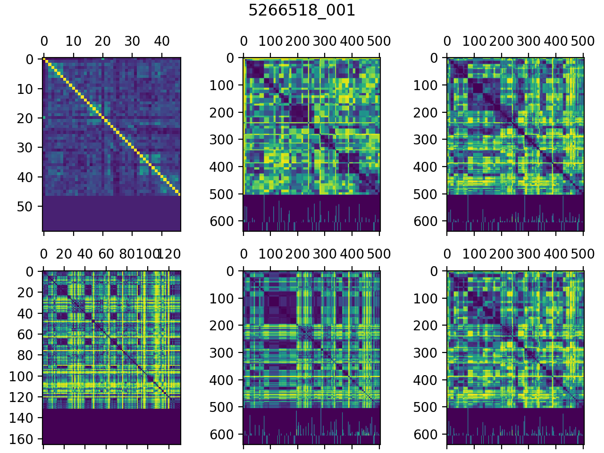

# content-segmentation
Repository used for the development of methods for automatic content segmentation in editorial parts. It is based on fusing the results of the segmentation done on two modalities: textual and visual.

The textual segmentation relies on the ASR-generated subtitles for the content, whereas the visual segmentation uses an initial shot-segmentation of the video content. These are generated by Limecraft's Flow backend.


## Textual segmentation

To generate segment boundary candidates, we use the provided automatically-generated subtitles (SRT files).
The segmentation is done using a multilingual Sentence-BERT. Each sentence is encoded into a 768-d vector representation, and a segment boundary candidate is detected wherever the similarity score between successive sentences is minimal (i.e. a valley in the curve of pairwise similarity).

For the MeMAD collection, the results are generated for all programs and saved into the file `textual-input/ina_subtitle_neighborhood_similarity.pickle`.


The segmentation is done using the `text_segment.py`. When given `<filename>.srt` file as input (alongside other hyperparameters such as window size and aggregation method), the script would produce 2 files at the output path folder:
* `<filename>.csv`: containing the segments boundaries suggested by the method (ordered by scores, from the most to the least likely)
* `<filename>.pickle`: a pickle object containing the start and end time for each subtitle (as arrays), as well as the similarity matrix for all subtitles in the input file.

To run the script:
```
usage: text_segment.py [-h] [-s SUBTITLES_PATH] [-o OUTPUT_PATH]
                       [-w WINDOW_SIZE] [-am {average,product}]
                       [-sm {minima,lowest}]

Arguments:
  -h, --help            show this help message and exit
  -s SUBTITLES_PATH, --subtitles_path SUBTITLES_PATH
                        Path to the subtitles path
  -o OUTPUT_PATH, --output_path OUTPUT_PATH
                        Path to save results.
  -w WINDOW_SIZE, --window_size WINDOW_SIZE
                        Neighborhood size for similarity.
  -am {average,product}, --aggregation_method {average,product}
  -sm {minima,lowest}, --scoring_method {minima,lowest}
```


## Visual segmentation

For the MeMAD collection experiments, the visual segmentation is done offline. As a result, and for every video in our collection, the following files are generated with [PicSOM](https://github.com/aalto-cbir/PicSOM)'s `analyse=videoshotsequence` mode:
```
visual-input/<VIDEO_LABEL>-time.npy
visual-input/<VIDEO_LABEL>-raw.npy
visual-input/<VIDEO_LABEL>-eq.npy
```

`<VIDEO_LABEL>` consists of the digits of the video filenames.

`<VIDEO_LABEL>-time.npy` contains a vector of the end time points of the visual shots as detected by Flow. If Flow has detected `N` shot boundaries, then the length of the time point vector is `N+1` and the last value tells the duration of the program.

`visual-input/<VIDEO_LABEL>-raw.npy` contains the matrix of raw shot-wise mutual distance values
`visual-input/<VIDEO_LABEL>-eq.npy`contains the matrix of shot-wise mutual distance values after histogram equalization to range [0,1].
These files are produced with PicSOM using ResNet-152 features extracted from the middle frames of the shots.

`combine.py` uses only the histogram equalized values. The matrix is of the size `N+1 x N+1`.


## Combining modalities

`combine.py` is used to read in text-based similarity measures and visual-based distance/dissimilarity measures (described in the two previous sections), combine them together in one second resolution (both shots and subtitles timings are put in a scale of seconds), plot the original and created dissimilarity matrices and output predictions for segment boundaries from individual and combined modalities.


### Example

```
./combine.py --data=ina 5266518001
```

Provided the textual similarity from `textual-input/ina_subtitle_neighborhood_similarity.pickle` and the visual segmentation from `visual-input/5266518001-eq.npy`, it creates two files: `5266518_001.png` and `5266518_001.txt`.

The png file visualizes the input unimodal and combined bimodal distance matrices, the segment boundary scores and the part boundary ground truths.

<div align="center"></div>


The txt file consists of four lines like:
```
txt (48 1.0000) (13 0.9705) (267 0.8499)  ...
vis (11 1.0000) (266 0.5472) (221 0.5001) ...
sum (11 1.0000) (221 0.7681) (48 0.7172)  ...
mul (11 1.0000) (48 0.6896) (221 0.6165)  ...
```

The lines above are for textual, visual and two combined methods for detecting the segment boundaries.  Within parentheses, the first value is the predicted starting second for a segment and the second value is the corresponding prediction score normalized within [0, 1].
